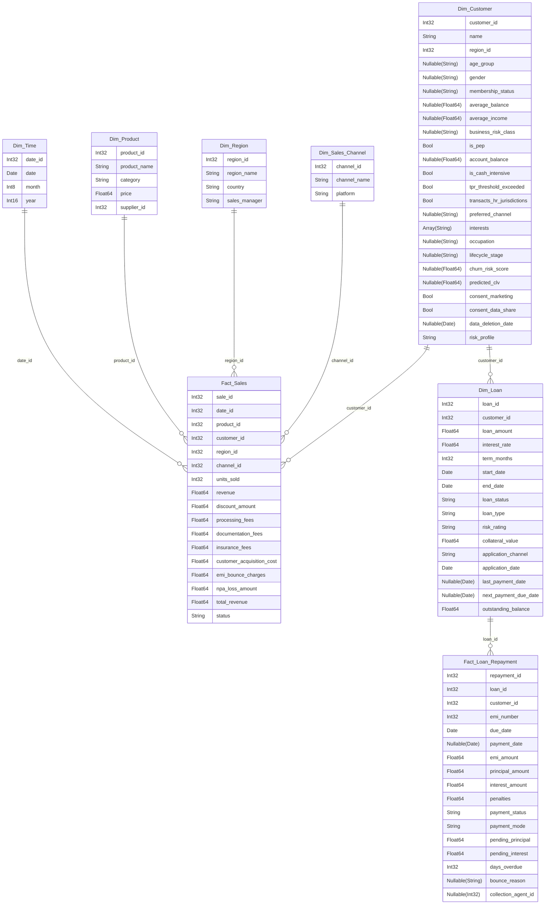

```mermaid
erDiagram
    Dim_Time ||--o{ Fact_Sales : "date_id"
    Dim_Product ||--o{ Fact_Sales : "product_id"
    Dim_Region ||--o{ Fact_Sales : "region_id"
    Dim_Sales_Channel ||--o{ Fact_Sales : "channel_id"
    Dim_Customer ||--o{ Fact_Sales : "customer_id"
    Dim_Customer ||--o{ Dim_Loan : "customer_id"
    Dim_Loan ||--o{ Fact_Loan_Repayment : "loan_id"

    Dim_Time {
        Int32 date_id
        Date date
        Int8 month
        Int16 year
    }

    Dim_Product {
        Int32 product_id
        String product_name
        String category
        Float64 price
        Int32 supplier_id
    }

    Dim_Region {
        Int32 region_id
        String region_name
        String country
        String sales_manager
    }

    Dim_Sales_Channel {
        Int32 channel_id
        String channel_name
        String platform
    }

    Dim_Customer {
        Int32 customer_id
        String name
        Int32 region_id
        Nullable(String) age_group
        Nullable(String) gender
        Nullable(String) membership_status
        Nullable(Float64) average_balance
        Nullable(Float64) average_income
        Nullable(String) business_risk_class
        Bool is_pep
        Nullable(Float64) account_balance
        Bool is_cash_intensive
        Bool tpr_threshold_exceeded
        Bool transacts_hr_jurisdictions
        Nullable(String) preferred_channel
        Array(String) interests
        Nullable(String) occupation
        Nullable(String) lifecycle_stage
        Nullable(Float64) churn_risk_score
        Nullable(Float64) predicted_clv
        Bool consent_marketing
        Bool consent_data_share
        Nullable(Date) data_deletion_date
        String risk_profile
    }

    Dim_Loan {
        Int32 loan_id
        Int32 customer_id
        Float64 loan_amount
        Float64 interest_rate
        Int32 term_months
        Date start_date
        Date end_date
        String loan_status
        String loan_type
        String risk_rating
        Float64 collateral_value
        String application_channel
        Date application_date
        Nullable(Date) last_payment_date
        Nullable(Date) next_payment_due_date
        Float64 outstanding_balance
    }

    Fact_Sales {
        Int32 sale_id
        Int32 date_id
        Int32 product_id
        Int32 customer_id
        Int32 region_id
        Int32 channel_id
        Int32 units_sold
        Float64 revenue
        Float64 discount_amount
        Float64 processing_fees
        Float64 documentation_fees
        Float64 insurance_fees
        Float64 customer_acquisition_cost
        Float64 emi_bounce_charges
        Float64 npa_loss_amount
        Float64 total_revenue
        String status
    }

    Fact_Loan_Repayment {
        Int32 repayment_id
        Int32 loan_id
        Int32 customer_id
        Int32 emi_number
        Date due_date
        Nullable(Date) payment_date
        Float64 emi_amount
        Float64 principal_amount
        Float64 interest_amount
        Float64 penalties
        String payment_status
        String payment_mode
        Float64 pending_principal
        Float64 pending_interest
        Int32 days_overdue
        Nullable(String) bounce_reason
        Nullable(Int32) collection_agent_id
    }
```
