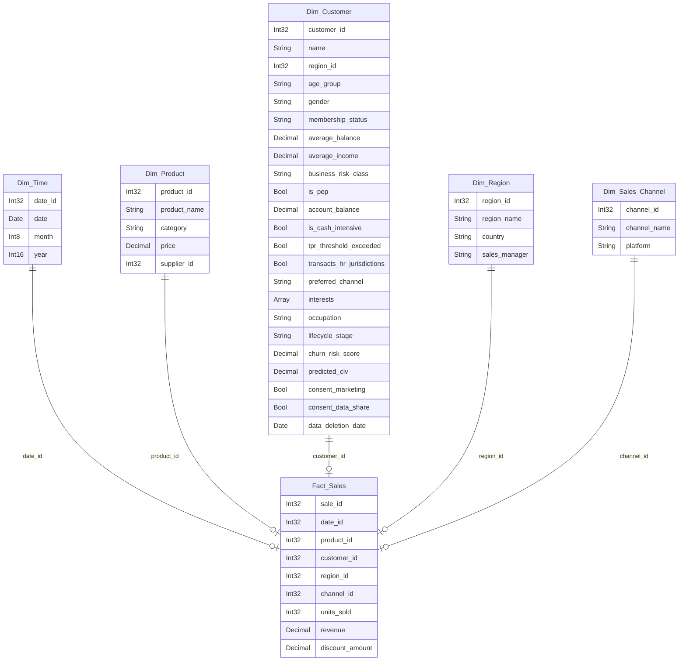

```mermaid
erDiagram
    Dim_Time {
        Int32 date_id
        Date date
        Int8 month
        Int16 year
    }

    Dim_Product {
        Int32 product_id
        String product_name
        String category
        Decimal price
        Int32 supplier_id
    }

    Dim_Region {
        Int32 region_id
        String region_name
        String country
        String sales_manager
    }

    Dim_Sales_Channel {
        Int32 channel_id
        String channel_name
        String platform
    }

    Dim_Customer {
        Int32 customer_id
        String name
        Int32 region_id
        String age_group
        String gender
        String membership_status
        Decimal average_balance
        Decimal average_income
        String business_risk_class
        Bool is_pep
        Decimal account_balance
        Bool is_cash_intensive
        Bool tpr_threshold_exceeded
        Bool transacts_hr_jurisdictions
        String preferred_channel
        Array interests
        String occupation
        String lifecycle_stage
        Decimal churn_risk_score
        Decimal predicted_clv
        Bool consent_marketing
        Bool consent_data_share
        Date data_deletion_date
    }

    Fact_Sales {
        Int32 sale_id
        Int32 date_id
        Int32 product_id
        Int32 customer_id
        Int32 region_id
        Int32 channel_id
        Int32 units_sold
        Decimal revenue
        Decimal discount_amount
    }

    Dim_Time ||--o| Fact_Sales : "date_id"
    Dim_Product ||--o| Fact_Sales : "product_id"
    Dim_Customer ||--o| Fact_Sales : "customer_id"
    Dim_Region ||--o| Fact_Sales : "region_id"
    Dim_Sales_Channel ||--o| Fact_Sales : "channel_id"
```
